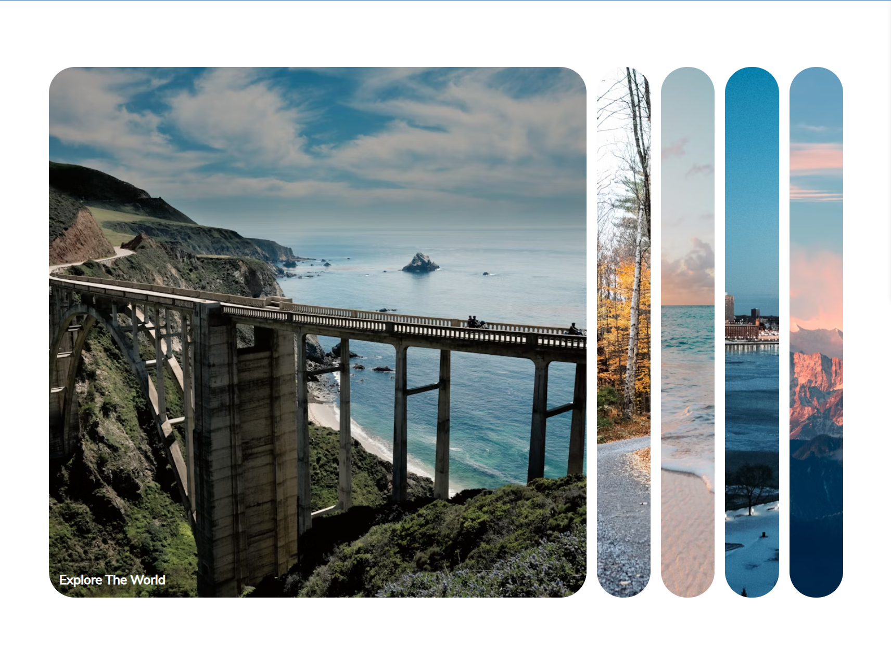

# 50 Projects 50 Days

|  #  | Project                                                                                                              | Live Demo                                                                                                                                    | Screenshot                                                              | Video |
| :-: | -------------------------------------------------------------------------------------------------------------------- | -------------------------------------------------------------------------------------------------------------------------------------------- | ----------------------------------------------------------------------- | ----- |
| 01  | [Expanding Cards](https://github.com/mtran36/50projects50days-2024/tree/main/day_1_expandingCards)                   | [Live Demo](https://htmlpreview.github.io/?https://github.com/mtran36/50projects50days-2024/blob/main/day_1_expandingCards/index.html)       |  |       |
| 02  | [Progress Steps](https://github.com/mtran36/50projects50days-2024/tree/main/day_2_progressSteps)                     | [Live Demo](https://htmlpreview.github.io/?https://github.com/mtran36/50projects50days-2024/blob/main/day_2_progressSteps/index.html)        |                                                                         |       |
| 03  | [Rotating Navigation Animation](https://github.com/mtran36/50projects50days-2024/tree/main/day_3_rotateNavAnimation) | [Live Demo](https://htmlpreview.github.io/?https://github.com/mtran36/50projects50days-2024/blob/main/day_3_rotateNavAnimation/index.html)   |                                                                         |       |
| 04  | [Hidden Search](https://github.com/mtran36/50projects50days-2024/tree/main/day_4_hiddenSearch)                       | [Live Demo](https://htmlpreview.github.io/?https://github.com/mtran36/50projects50days-2024/blob/main/day_4_hiddenSearch/index.html)         |                                                                         |       |
| 05  | [Blurry Loading](https://github.com/mtran36/50projects50days-2024/tree/main/day_5_blurryLoading)                     | [Live Demo](https://htmlpreview.github.io/?https://github.com/mtran36/50projects50days-2024/blob/main/day_5_blurryLoading/index.html)        |                                                                         |       |
| 06  | [Scroll Animation](https://github.com/mtran36/50projects50days-2024/tree/main/day_6_scrollAnimation)                 | [Live Demo](https://github.com/mtran36/50projects50days-2024/blob/main/day_6_scrollAnimation/index.html)                                     |                                                                         |       |
| 07  | [Split Landing Page](https://github.com/mtran36/50projects50days-2024/tree/main/day_7_splitLandingPage)              | [Live Demo](https://htmlpreview.github.io/?https://github.com/mtran36/50projects50days-2024/blob/main/day_7_splitLandingPage/index.html)     |                                                                         |       |
| 08  | [Form Input Wave](https://github.com/mtran36/50projects50days-2024/tree/main/day_8_formInputWave)                    | [Live Demo](https://htmlpreview.github.io/?https://github.com/mtran36/50projects50days-2024/blob/main/day_8_formInputWave/index.html)        |                                                                         |       |
| 09  | [Sound Board](https://github.com/mtran36/50projects50days-2024/tree/main/day_9_soundBoard)                           | [Live Demo](https://htmlpreview.github.io/?https://github.com/mtran36/50projects50days-2024/blob/main/day_9_soundBoard/index.html)           |                                                                         |       |
| 10  | [Dad Jokes](https://github.com/mtran36/50projects50days-2024/tree/main/day_10_dadJokes)                              | [Live Demo](https://htmlpreview.github.io/?https://github.com/mtran36/50projects50days-2024/blob/main/day_10_dadJokes/index.html)            |                                                                         |       |
| 11  | [Event Key Codes](https://github.com/mtran36/50projects50days-2024/tree/main/day_11_eventKeyCodes)                   | [Live Demo](https://htmlpreview.github.io/?https://github.com/mtran36/50projects50days-2024/blob/main/day_11_eventKeyCodes/index.html)       |                                                                         |       |
| 12  | [FAQ Collapse](https://github.com/mtran36/50projects50days-2024/tree/main/day_12_faqCollapse)                        | [Live Demo](https://htmlpreview.github.io/?https://github.com/mtran36/50projects50days-2024/blob/main/day_12_faqCollapse/index.html)         |                                                                         |       |
| 13  | [Random Choice Picker](https://github.com/mtran36/50projects50days-2024/tree/main/day_13_randomChoice)               | [Live Demo](https://htmlpreview.github.io/?https://github.com/mtran36/50projects50days-2024/blob/main/day_13_randomChoice/index.html)        |                                                                         |       |
| 14  | [Animated Navigation](https://github.com/mtran36/50projects50days-2024/tree/main/day_14_animatedNavigation)          | [Live Demo](https://htmlpreview.github.io/?https://github.com/mtran36/50projects50days-2024/blob/main/day_14_animatedNavigation/index.html)  |                                                                         |       |
| 15  | [Incrementing Counter](https://github.com/mtran36/50projects50days-2024/tree/main/day_15_incrementingCounter)        | [Live Demo](https://htmlpreview.github.io/?https://github.com/mtran36/50projects50days-2024/blob/main/day_15_incrementingCounter/index.html) |                                                                         |       |
| 16  | [Drink Water Tracker](https://github.com/mtran36/50projects50days-2024/tree/main/day_16_drinkWaterTracker)           | [Live Demo](https://htmlpreview.github.io/?https://github.com/mtran36/50projects50days-2024/blob/main/day_16_drinkWaterTracker/index.html)   |                                                                         |       |
| 17  | [Movie Synopsis](https://github.com/mtran36/50projects50days-2024/tree/main/day_17_movieSynopsis)                    | [Live Demo](https://htmlpreview.github.io/?https://github.com/mtran36/50projects50days-2024/blob/main/day_17_movieSynopsis/index.html)       |                                                                         |       |
| 18  | [Background Slider](https://github.com/mtran36/50projects50days-2024/tree/main/day_18_backgroundSlider)              | [Live Demo](https://htmlpreview.github.io/?https://github.com/mtran36/50projects50days-2024/blob/main/day_18_backgroundSlider/index.html)    |                                                                         |       |
| 19  | [Theme Clock](https://github.com/mtran36/50projects50days-2024/tree/main/day_19_themeClock)                          | [Live Demo](https://htmlpreview.github.io/?https://github.com/mtran36/50projects50days-2024/blob/main/day_19_themeClock/index.html)          |                                                                         |       |
| 20  | [Button Ripple Effect](https://github.com/mtran36/50projects50days-2024/tree/main/day_20_buttonRippleEffect)         | [Live Demo](https://htmlpreview.github.io/?https://github.com/mtran36/50projects50days-2024/blob/main/day_20_buttonRippleEffect/index.html)  |                                                                         |       |
| 21  | [Drag N Drop](https://github.com/mtran36/50projects50days-2024/tree/main/day_21_dragNDrop)                           | [Live Demo](https://htmlpreview.github.io/?https://github.com/mtran36/50projects50days-2024/blob/main/day_21_dragNDrop/index.html)           |                                                                         |       |
| 22  | [Drawing Notepad](https://github.com/mtran36/50projects50days-2024/tree/main/day_22_drawingNotepad)                  | [Live Demo](https://htmlpreview.github.io/?https://github.com/mtran36/50projects50days-2024/blob/main/day_22_drawingNotepad/index.html)      |                                                                         |       |
| 23  | [Kinetic Loader](https://github.com/mtran36/50projects50days-2024/tree/main/day_23_kineticLoader)                    | [Live Demo](https://htmlpreview.github.io/?https://github.com/mtran36/50projects50days-2024/blob/main/day_23_kineticLoader/index.html)       |                                                                         |       |
| 24  | [Content Placeholder](https://github.com/mtran36/50projects50days-2024/tree/main/day_24_contentPlaceholder)          | [Live Demo](https://htmlpreview.github.io/?https://github.com/mtran36/50projects50days-2024/blob/main/day_24_contentPlaceholder/index.html)  |                                                                         |       |
| 25  | [Sticky Navigation](https://github.com/mtran36/50projects50days-2024/tree/main/day_25_stickyNavigation)              | [Live Demo](https://htmlpreview.github.io/?https://github.com/mtran36/50projects50days-2024/blob/main/day_25_stickyNavigation/index.html)    |                                                                         |       |
| 26  |                                                                                                                      |                                                                                                                                              |                                                                         |       |
| 27  |                                                                                                                      |                                                                                                                                              |                                                                         |       |
| 28  |                                                                                                                      |                                                                                                                                              |                                                                         |       |
| 29  |                                                                                                                      |                                                                                                                                              |                                                                         |       |
| 30  |                                                                                                                      |                                                                                                                                              |                                                                         |       |
